# 🛠️ SQL Query Web App For Data Analyst

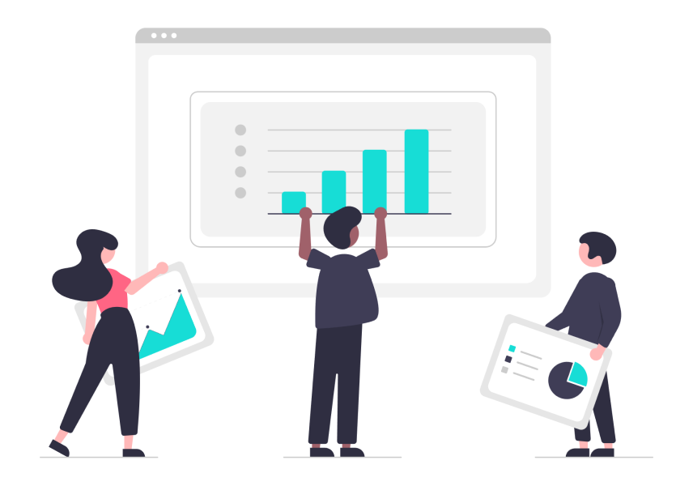

A web-based SQL query execution and visualization tool with AI-powered query generation and speech recognition.

## 🚀 Features

✅ **User Authentication**

- 🔐 Secure login page with authentication
- 🏠 Home page with a personalized dashboard
- 🔒 Protected Routes to restrict access to authenticated users

✅ **Database Management**

- 📂 Sidebar displaying available databases & tables
- 🔚 Logout option for secure session handling

✅ **SQL Query Execution**

- ⌨️ Input field for writing SQL queries
- ▶️ Execute queries with a single click
- 📜 Query history to track previously executed queries

✅ **AI-Powered Query Generation**

- 🤖 Generate SQL queries using **Gemini OpenAI** from natural language
- 🎙️ Speech-to-text support for hands-free query generation

✅ **Data Visualization**

- 📊 **Table View** (Supports pagination, sorting, and result limiting, optimized for 1000s of rows)
- 📈 **Charts & Graphs:**

  - 📊 **Bar Chart** – Visual representation of categorical data
  - 🥧 **Pie Chart** – Percentage breakdown of data
  - 📉 **Line Chart** – Trends and time-series analysis
  - 🎯 **Scatter Plot** – Correlation and distribution visualization

✅ **Optimized Performance**

- ⏳ React Suspense & Lazy Loading for faster page load times

✅ **Toastify Notifications**

- 🔔 **Real-time alerts** for query execution status, errors, and AI suggestions

✅ Modular Styling

- 🎨 Used module.css for scoped and maintainable styles

## 📸 Screenshots

| Feature                                       | Screenshot                                        |
| --------------------------------------------- | ------------------------------------------------- |
| **Login Page**                                | 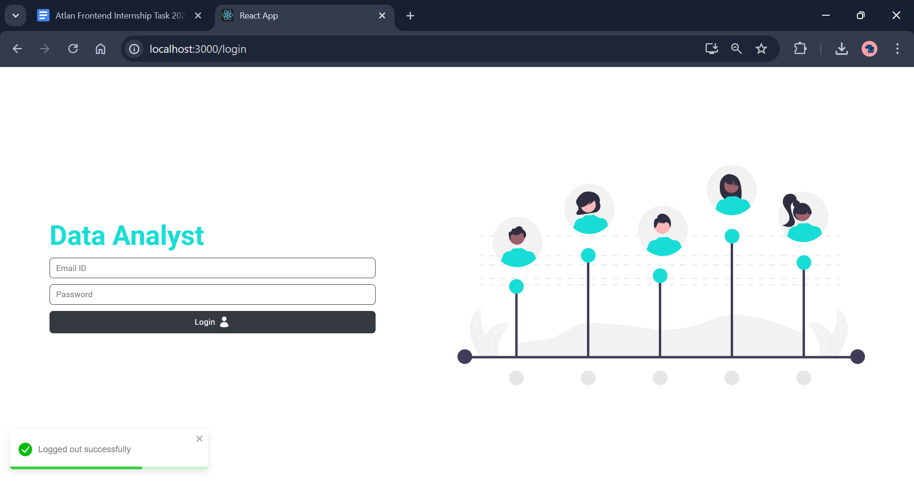               |
| **Home Page / Sidebar / SQL Query Input**     | 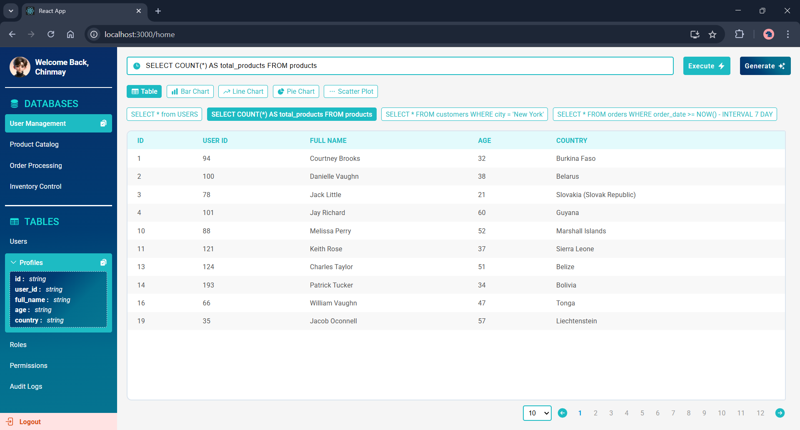                 |
| **AI Query Generation / Speech Recognition**  | 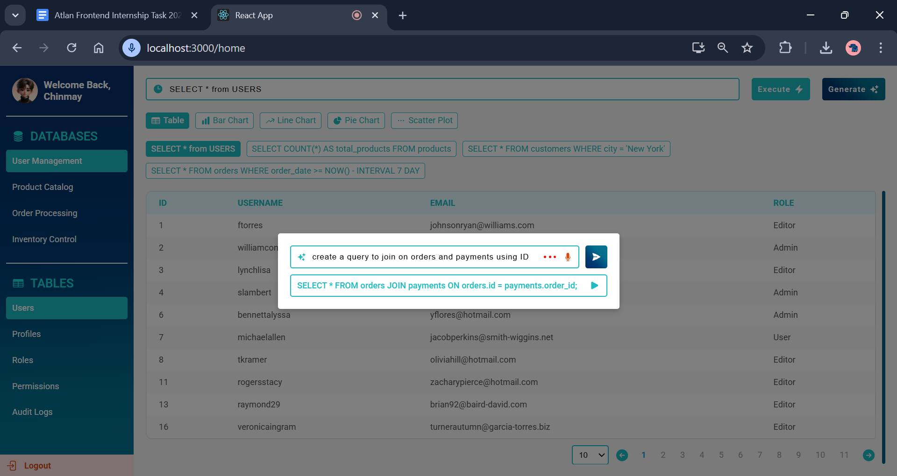         |
| **Query History**                             | 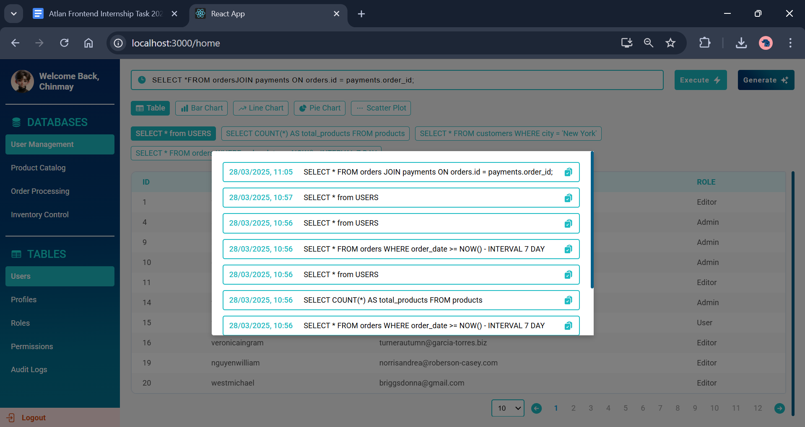           |
| **Table View (2000+ Rows) / Sorting & Limit** | 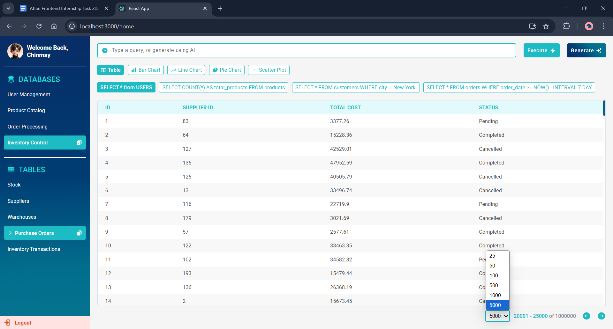     |
| **Bar Chart**                                 | 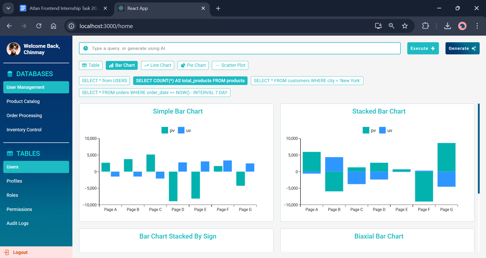       |
| **Pie Chart**                                 | 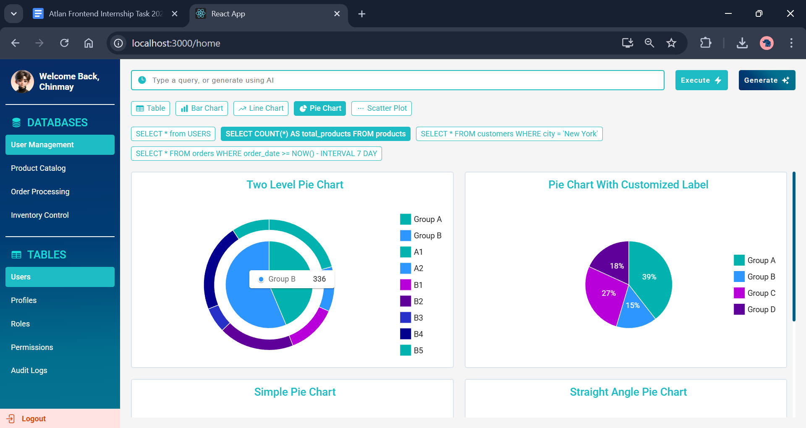       |
| **Line Chart**                                | 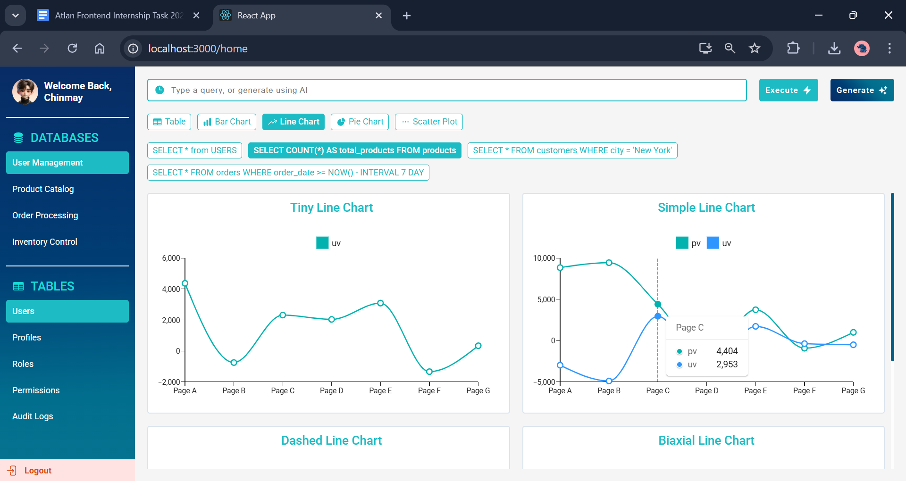     |
| **Scatter Plot**                              | 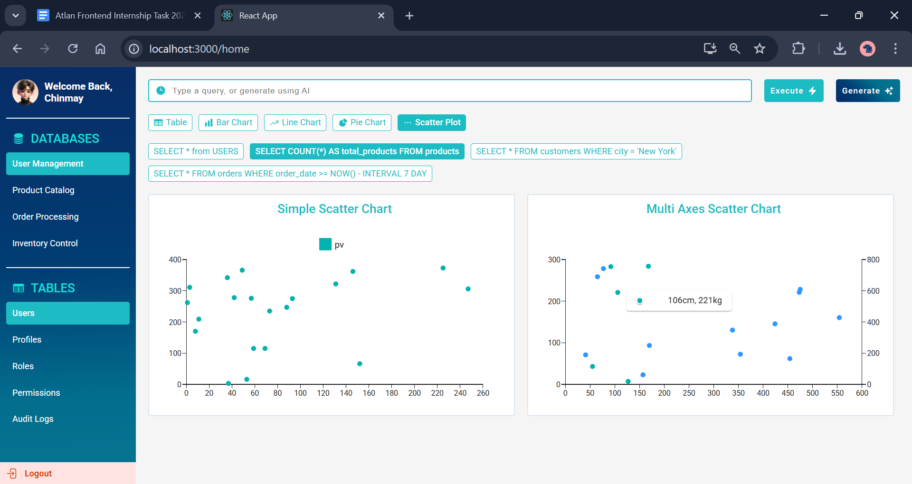 |
| **Not Found Page**                            | 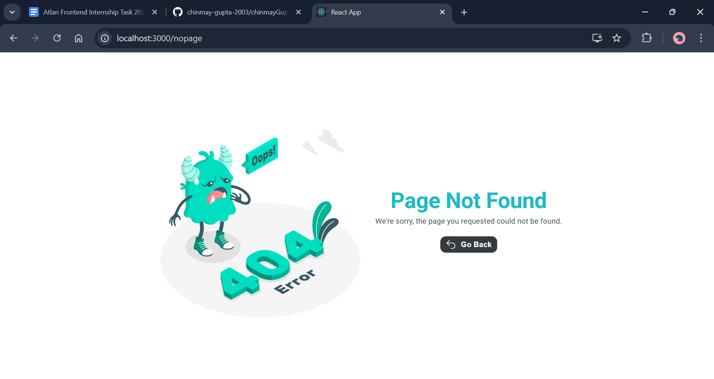   |

## 📦 Installed Plugins & Packages

- **🚀 Core Libraries**

  - ⚛️ `react`
  - ⚛️ `react-dom`
  - 📜 `react-scripts`

- **🛤️ Routing**

  - 🧭 `react-router-dom`

- **📦 State Management**

  - 🎛️ `@reduxjs/toolkit`
  - 🔗 `react-redux`

- **📊 Charts & Data Visualization**

  - 📈 `@mui/x-charts`
  - 🎨 `@emotion/react`
  - 🎨 `@emotion/styled`
  - 🖌️ `@mui/material`

- **🔣 Icons**

  - 🖼️ `@heroicons/react`

- **⚡ Loaders & Notifications**
  - ⏳ `react-spinners`
  - 🔔 `react-toastify`

## ⚡ Page Load Time & Performance Optimizations

### 📊 Initial Performance Measurement

- **Tool Used:** [Lighthouse](https://developer.chrome.com/docs/lighthouse/overview/)
- **Initial Score:** The initial page load time was high, and Lighthouse reported performance issues related to large bundle sizes and render-blocking resources.

### 🚀 Optimizations Implemented

To improve performance, the following optimizations were applied:

✅ **React Suspense & Lazy Loading**

- Implemented `React.lazy()` and `Suspense` to load components only when required.
- Lazy-loaded pages and charts to reduce initial bundle size.

✅ **Code Splitting**

- Used dynamic imports for routes and UI components.
- Reduced JavaScript execution time and improved Time to Interactive (TTI).

✅ **Lighthouse Performance Improvement**  
After implementing these optimizations, the Lighthouse score improved significantly.

### 📸 Lighthouse Results

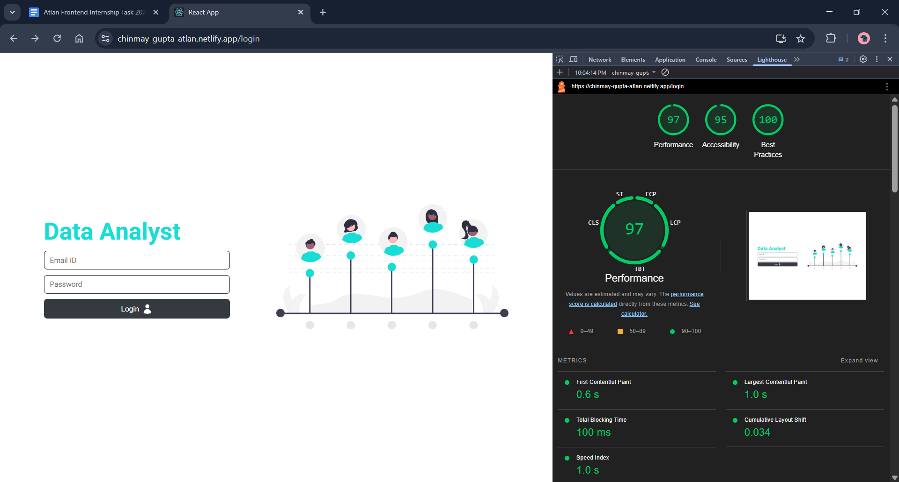
